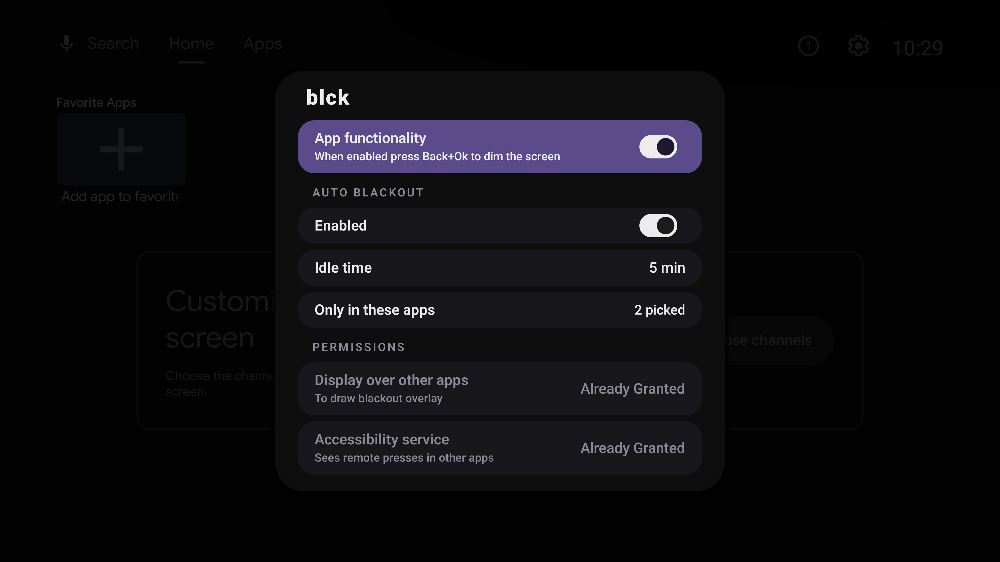

<h2 align="center">
  
   
    blck — turns your TV screen off without stopping whatever is playing
</h2>

Listening to something on a TV usually means looking at it too. Screensavers and sleep timers kill playback along with the picture.
`blck` simply draws a black overlay over the screen. On OLED and Mini LED TVs, this looks the same as turning the screen off.
The app underneath keeps running, the sound keeps playing, any key brings the picture back.

## Features
- Press `Back` + `OK` to black out the screen
- Black out the screen automatically after a set idle time in selected apps
- Press any button (except volume) to turn the picture back on

## Limitations
On regular LED TVs, the backlight stays on, so the screen may glow slightly.

## Requirements
Google TV or Android TV, version 11 or newer.

## Installation
- Sideload the APK for your architecture
- Open the app and grant the requested permissions

### Additional steps for TCL TVs
Open `Safety Guard` → `Permission Shield`, find `blck` and set it to `Opened` in both:
- Auto Launch Permission
- Relevance Start Permission

## Privacy

No internet permission. No data collection. No tracking.

### Why these permissions?
- Display over other apps: to show the black overlay
- Accessibility service: to detect the `Back` + `OK` shortcut and remote activity for the idle timer (key presses are never stored)
- Query all packages: to list installed apps so you can choose where auto blackout works
- Foreground service: to keep the app running in the background
